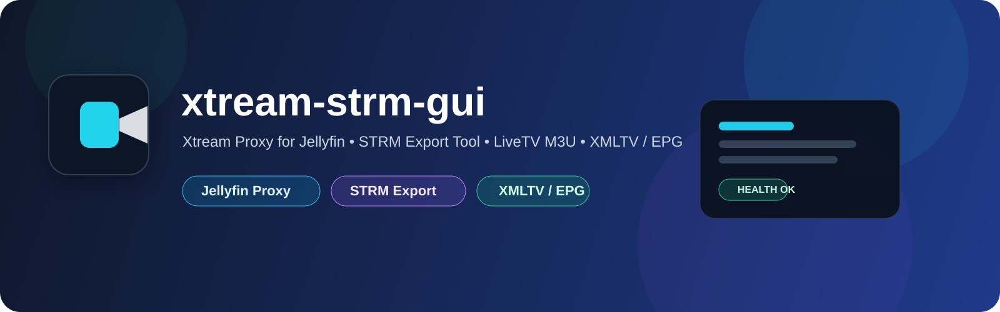

# xtream-strm-gui

<p align="center">
  
</p>

<p align="center">
  <b>Xtream Proxy for Jellyfin + STRM Export Tool for Jellyfin Libraries</b>
</p>

<p align="center">
  
  
  
  
  
</p>

---

## What this project does

`xtream-strm-gui` combines **two main functions** in one application:

### 1. Xtream Proxy for Jellyfin

The application can act as an **Xtream API server** that exposes content from Jellyfin to IPTV apps.

Typical use case:

- connect an IPTV app like **UHF**, **TiviMate**, **IPTV Smarters**, etc.
- use Jellyfin libraries as a source
- provide:
  - Live TV
  - Movies (VOD)
  - Series
- automatic stream URL selection for:
  - local network
  - external / WAN access
- XMLTV / EPG support

Flow:

```text
IPTV App → xtream-strm-gui (/proxy) → Jellyfin → Stream
```

---

### 2. STRM Export Tool for Jellyfin

The application can also connect to an **Xtream API source** and export content into a Jellyfin-friendly structure.

Typical use case:

- import movies and series from an Xtream provider
- generate `.strm` files
- save them into your desired folder structure
- add the generated folders to Jellyfin as normal libraries
- export Live TV as an `.m3u` file for Jellyfin Live TV integration
  

Flow:

```text
Xtream API → xtream-strm-gui → STRM / M3U Export → Jellyfin Library
```

---

## Core features

- Xtream API integration
- Jellyfin integration
- Xtream proxy for Jellyfin content
- STRM export for movies
- STRM export for series with season / episode structure
- Live TV export as M3U
- XMLTV / EPG support
- profile system
- scheduler / automatic exports
- web GUI
- health endpoint
- proxy / scheduler / export status overview

---

## Function 1: Xtream Proxy (Jellyfin → IPTV App)

### What it does

This mode exposes selected Jellyfin libraries through an Xtream-compatible API.

### You can choose

In the GUI, you can select **which Jellyfin libraries** should be offered through the Xtream proxy.

Examples:

- only Movies
- only Series
- Movies + Series
- selected libraries only

### Proxy endpoints

Main Xtream endpoint:

```text
http://<host>:8787/proxy/player_api.php
```

Streams:

```text
Live TV:
/proxy/live/{username}/{password}/{id}.ts

Movies:
/proxy/movie/{username}/{password}/{id}.mp4

Series:
/proxy/series/{username}/{password}/{id}.mp4
```

### EPG / XMLTV

```text
http://<host>:8787/xmltv.php
```

or

```text
http://<host>:8787/proxy/xmltv.php
```

---

## Function 2: STRM Export Tool (Xtream → Jellyfin)

### What it does

This mode pulls content from an Xtream source and writes it to disk in a format that Jellyfin can index.

### You can choose

In the GUI, you can select exactly what should be imported from the Xtream source:

- Live TV categories
- Movie categories
- Series categories
- individual exclusions

### Export result

- **Movies** → `.strm` files
- **Series** → series / season / episode `.strm` structure
- **Live TV** → `.m3u` file for Jellyfin Live TV integration

Example structure:

```text
/output/
├── Movies/
│   └── Movie Name (Year)/
│       └── Movie Name.strm
├── Series/
│   └── Show Name/
│       └── Season 01/
│           └── S01E01.strm
└── livetv.m3u
```

---

## Live TV in Jellyfin

Live TV is exported as an `.m3u` file.

Example:

```text
/output/livetv.m3u
```

You can then add it in Jellyfin via:

- **Dashboard**
- **Live TV**
- **Tuners**
- add **M3U tuner**

---

## Health endpoint

The application provides a health endpoint:

```text
http://<host>:8787/healthz
```

It can be used to check:

- whether the server is alive
- since when the server is running
- whether proxy configuration is complete
- whether a scheduler is enabled
- next scheduled run
- whether an export is currently running
- export phase and status

---

## Project structure

```text
app/
├── main.py
├── xtream_api.py
├── jellyfin_api.py
├── proxy_core.py
├── export_core.py
├── state_core.py
├── templates/
│   ├── index.html
│   └── login.html
├── static/
│   ├── css/
│   └── js/
│       ├── state.js
│       ├── utils.js
│       ├── api.js
│       ├── render.js
│       ├── actions.js
│       └── init.js
```

---

## Required files

### Backend

- `main.py`
- `xtream_api.py`
- `jellyfin_api.py`
- `proxy_core.py`
- `export_core.py`
- `state_core.py`

### Templates

- `templates/index.html`
- `templates/login.html`

### Frontend JavaScript

- `static/js/state.js`
- `static/js/utils.js`
- `static/js/api.js`
- `static/js/render.js`
- `static/js/actions.js`
- `static/js/init.js`

### Optional / recommended

- `Dockerfile`
- `requirements.txt`
- `.env`
- `docker-compose.yml`

---

## Configuration overview

### Xtream source connection

- base URL
- username
- password

### Export output

- root output directory
- movie directory
- series directory
- Live TV M3U filename

### Selection

- selected Live TV categories
- selected movie categories
- selected series categories
- excluded items
- selected Jellyfin proxy libraries

### Sync

- delete removed files

### Scheduler

- enabled / disabled
- daily / weekly / interval mode
- execution time
- weekday
- interval days
- profile binding

---

### 📊 Status & Live Monitoring

During export, the GUI shows:
- Current phase
- Progress bar
- Status messages
- Live logs

---

### 📋 Report & Summary

After each export:
- Selected categories
- Number of:
  - LiveTV channels
  - Movies
  - Series
  - Episodes
- Excluded items
- Written files
- Deleted files

---

### 🔄 Change Tracking

Displays:
- Newly added content
- Removed content

---

### Proxy

- Jellyfin local base URL
- Jellyfin external base URL
- Jellyfin API key
- proxy username
- proxy password
- XMLTV URL

---

## Screenshots

### Dashboard


### Proxy configuration


### Export / selection view


### Scheduler / automation


---

## Docker example

```bash
docker run -d \
  --name xtream-strm-gui \
  -p 8787:8787 \
  -v /mnt/user/appdata/xtream-strm-gui:/data \
  xtream-strm-gui
```

---

## Security notes

- GUI can be restricted to the local network
- GUI login supported
- proxy credentials separated from GUI login
- Jellyfin API key required
- IP ban / rate-limit logic can be added for failed login attempts

Recommended:

- run behind a reverse proxy
- enable HTTPS
- use strong GUI and proxy credentials

---

## Quick test commands

### Health

```bash
curl -s http://<host>:8787/healthz
```

### Xtream account info

```bash
curl -s "http://<host>:8787/proxy/player_api.php?username=USER&password=PASS"
```

### Live categories

```bash
curl -s "http://<host>:8787/proxy/player_api.php?username=USER&password=PASS&action=get_live_categories"
```

### Movie categories

```bash
curl -s "http://<host>:8787/proxy/player_api.php?username=USER&password=PASS&action=get_vod_categories"
```

### Series categories

```bash
curl -s "http://<host>:8787/proxy/player_api.php?username=USER&password=PASS&action=get_series_categories"
```

---

## Roadmap ideas

- better EPG channel mapping
- advanced health checks
- proxy statistics
- backup / restore for profiles and config
- improved live logs in GUI
- reverse proxy examples
- GitHub Actions / GHCR publishing

---

## Summary

`xtream-strm-gui` combines:

- an **Xtream proxy for Jellyfin**
- a **STRM export tool for Xtream sources**
- a **Live TV M3U export for Jellyfin**
- **XMLTV / EPG support**
- a **scheduler and web GUI**

in a single application.
